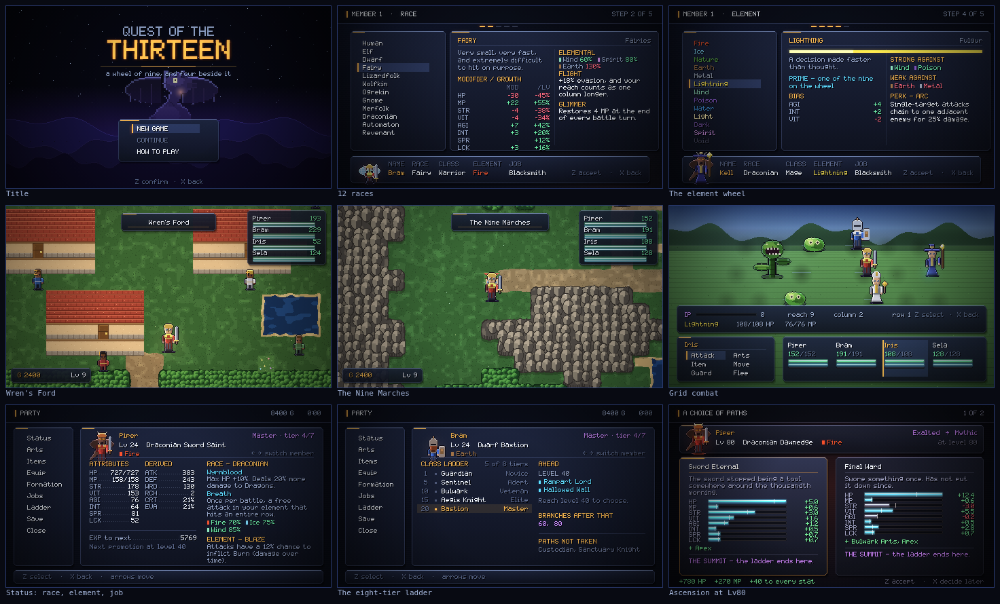

# Quest of the Thirteen

An HD-2D turn-based RPG that borrows deliberately:

| From | What |
| --- | --- |
| **Dragon Quest III** | vocation-style class promotion, a party you build yourself at the guild, front-view battles, a temple that witnesses your advancement |
| **Lufia: The Legend Returns** | two facing 3×3 battle grids where your column decides what you can reach, and IP gauges that fill from damage |
| **HD-2D** | the presentation — pixel figures under real lighting, depth-of-field bloom, colour grading and vignette over a 480×270 framebuffer |



Runs in any modern browser. No build step, no dependencies.

**Play it right now:** **[piperwindsorstar-blip.github.io/Piper](https://piperwindsorstar-blip.github.io/Piper/)**
— no download, just a link to send someone.

**To play it offline:** download **`docs/play.html`** and double-click it. That
one file is the entire game — every sprite, map and system inlined, nothing to
install, no server. Saves live in that browser's local storage (separately for
the web link and the downloaded file, since each is its own origin).

**To work on it**, run it from source (needs [Node](https://nodejs.org) 18+):

```bash
npm start          # serves on http://localhost:8080
npm test           # 80 data-integrity checks
npm run sim        # headless battle balance simulation
npm run check      # both
npm run bundle     # regenerate docs/play.html from src/
```

Opening `index.html` directly does *not* work — browsers refuse to load ES
modules over `file://`. That restriction is the only reason the single-file
build exists.

**Controls** — arrows/WASD walk · `Z`/Enter confirm · `X`/Esc cancel · `C`/Tab party menu · `Shift` context action (random name, unequip, auto-formation, delete save). Touch controls appear automatically on touch devices, or can be forced on or off from **TOUCH CONTROLS** on the title screen or **Controls** in the party menu. The game plays in landscape; a touch device held portrait is asked to rotate rather than trying to squeeze a 480×270 world into a tall, narrow screen.

---

## The four systems

### 12 races

A race is picked once at creation and touches every layer of the game: flat
stat modifiers, **per-level growth multipliers** (so the choice compounds over
eighty levels rather than washing out), elemental resistances, two traits with
real mechanical hooks, and the anatomy the sprite generator draws from — ears,
muzzle, tail, wings, horns, build.

| Race | Traits |
| --- | --- |
| Human | Adaptable · Resolve |
| Elf | Arcane Blood · Longsight |
| Dwarf | Forgeborn · Rooted |
| Fairy | Flight · Glimmer |
| Lizardfolk | Scaled Hide · Regrow |
| Wolfkin | Keen Scent · Packborn |
| Ogrekin | Giant's Frame · Thick Skull |
| Gnome | Tinker · Small Frame |
| Merfolk | Tidecall · Deep Lung |
| Draconian | Wyrmblood · Breath |
| Automaton | Clockwork · No Repair |
| Revenant | Deathless · Cold Blood |

Traits are not flavour text. Forgeborn gives 20% more defence from armour and
shields; Arcane Blood cuts spell MP cost by 15%; an Automaton's Clockwork makes
it immune to Poison, Burn, Sleep, Confusion and Charm, and its No Repair means
potions restore only half — it wants an Artificer in the party instead.
Races also favour elements: a Dwarf who took Earth ranks up jobs 20% faster.

### 12 classes on an eight-tier ladder

Each of the twelve root classes grows a **twenty-two node tree**. Promotions
land on levels 5, 10, 15, 20, 40, 60 and 80, and **five of those seven are branch
points** where you choose between two successors.

```
Lv 1   Warrior                                    (Novice)
Lv 5   └─ Vanguard                                (Adept)
Lv10      ├─ Knight ──── Lv15 Paladin ─── Lv20 ┬ Sword Saint   (Master)
          │                                     └ Templar
          └─ Berserker ─ Lv15 Warlord ─── Lv20 ┬ Ravager
                                                └ Warbringer

Lv40/60/80   each Mastery opens onto two of four Ascension paths — a ring
```

12 roots × 22 nodes = **264 class nodes**, all with distinct names, growth and
skill schools.

Past the Mastery the tree would double three more times — 32 capstones per root,
384 names nobody would ever see. So the three Ascension tiers are wired as a
**ring** instead: four paths per root at each tier, where Mastery *i* opens onto
Ascension *i* and Ascension *i+1*. Every node is reachable from exactly two
predecessors, so every promotion is still a real two-way choice, but the tree
reconverges instead of exploding. The eight tiers run
Novice → Adept → Veteran → Elite → Master → Ascendant → Exalted → **Mythic**.

A class node does not carry a hand-written stat table; it carries a *bias*
applied to its root's growth profile, scaled by tier. A Berserker is always a
Warrior who traded defence for violence.

Growth accumulates **as it is earned**, so promoting late permanently costs you
the levels you spent growing at the lower rate. The validator asserts this.

### 13 elements on a wheel

Nine **prime** elements sit on a ring where each is strong against the two that
follow it and weak against the two that precede it — so the affinity table is
symmetric by construction rather than by hand-checking:

```
Fire → Ice → Nature → Earth → Metal → Lightning → Wind → Poison → Water → (Fire)
```

Four **arcane** elements sit off the ring in their own cycle
(Light → Dark → Spirit → Void), dealing neutral damage to the primes. Void is
the exception in the other direction: **Void damage ignores resistance entirely,
in both directions.**

An element is chosen once at creation and never changes. It grants a permanent
stat bias and a passive perk — Fire inflicts Burn, Wind gets evasion and a free
battle-grid reposition, Dark heals on kills, Water amplifies all healing.

### 20 jobs, ranked by use

A class is how you fight; a **job** is what you do for a living. Each job pays
out three ways: a rank-scaled stat bonus, a field ability, and a passive world
rule.

Jobs rank 1→5 **by use, not by level.** Sell things as a Merchant and your
prices improve; open chests as a Locksmith and traps start revealing themselves.
A character whose element or race favours the job ranks up faster.

Blacksmith · Armorer · Alchemist · Herbalist · Merchant · Appraiser · Chef ·
Provisioner · Miner · Fisher · Hunter · Scout · Cartographer · Locksmith ·
Tamer · Scribe · Bard · Pilgrim · Artificer · Sailor

---

## Combat

Two facing 3×3 grids. A unit's **effective column** is measured from its own
side's frontmost *living* rank, so killing the enemy front rank pulls the rank
behind it into reach. Distance between two units is

```
effCol(attacker) + effCol(target) + 1
```

and reach decides everything: daggers, fists, swords and maces reach 2; spears
and whips reach 3; bows, staves and every spell reach anywhere. A skill you
cannot reach with is not selectable; a basic attack that overreaches lands at
half power. Standing in the back column is safer — the enemy AI weights its
targeting toward whatever is in front.

**IP** fills from damage dealt and taken. Some Arts cost IP instead of MP, which
is what lets a Berserker out of MP still do something frightening.

Bosses take two turns per round; the second is restricted to a single target, so
a boss cannot open with two party-wide nukes.

**Grid-adjacent allies share a fraction of their own element's stat bias** —
the Lufia: The Legend Returns "Spiritual Force" idea, folded into the
13-element wheel instead of a second stat system. Whoever a unit is
orthogonally touching (never diagonal) lends them a slice of their bias;
the center of the grid ends up strongest purely because it has the most
neighbours (up to 4, against 3 on an edge and 2 in a corner) — nothing
special-cased, just adjacency counting. A status card gets a thin tint
naming which element is currently helping it.

**Losing your entire starting front rank is instant defeat**, even with a
healthy back line — a second Lufia rule, layered on top of the ordinary
total-party-wipe loss. Only triggers when the front rank was fully
staffed (all three rows); a party that never committed three members
forward never risks it.

---

## Story and recruitment

The seven bosses already form a three-act campaign: a bandit chief, a
golem tyrant, an undead choir, an ancient dragon guardian, then an
endgame gauntlet — a Gatekeeper, a World Heart, and finally **The
Thirteenth**, "the element that was left off the wheel" — the title's own
riddle, answered. An opening hook plays once on first entering the world,
per-region dialogue beats gate each boss, town NPCs react once their
region's threat falls, and a short epilogue closes the loop once The
Thirteenth does.

You build a 4-person party at creation, same as always, but the **roster**
isn't capped at 4 — every one of the game's 6 towns holds one named,
recruitable ally with their own fixed race, class and element, and the
roster can grow well past what fits in the active 3×3 formation. Whoever
isn't currently fighting waits on the **bench**, swappable in from the
party menu's Formation page for anyone already in the grid.

**Learning Points** (LP) are earned from every battle alongside gold and
EXP, and spent from the party menu's Train page to permanently raise a
stat — the same growth accumulator levelling already writes to, so it
composes with race, element, job and equipment for free.

Every smithy, pedlar, inn, temple and guildhall in every town is a real
room you walk into through its door, not a facade with an NPC standing in
front of it — the same warp mechanic that moves you between town and
overworld, reused for a doorway instead of a map edge. Wren's Ford and
Kelda each add two flavor homes beyond their five services, and every
small waypost town now has a General Store — plus wells, market stalls
and lampposts scattered through each plaza — so a town reads as lived-in
rather than a row of shops on an empty square.

---

## Layout

```
index.html            entry point
src/
  main.js             scene stack + fixed-step loop
  engine/
    screen.js         480x270 framebuffer, panels, bloom/grade/vignette post pass
    font.js           hand-drawn 5x7 proportional bitmap font
    pixel.js          the shared pixel primitives: outline, AO, rim light
    actor.js          character sprites, assembled per race + class + element
    monsters.js       monster body plans
    terrain.js        outdoor ground and landmasses, drawn across cells
    tiles.js          per-cell stamps for interiors and buildings
    particles.js      dust, embers, motes, torch flicker
    sprites.js        facade re-exporting the art modules
    input.js  ui.js  rng.js  save.js
  data/
    races.js          12 races: mods, growth multipliers, resists, traits, anatomy
    elements.js       13 elements; the wheel builds its own affinity table
    classes.js        12 trees flattened to 264 nodes across 8 tiers
    jobs.js           20 jobs
    skills.js         25 schools, 148 skills, 23 status effects
    items.js          113 items     enemies.js  41 enemies, 33 formations
    maps.js           overworld, 6 towns, 5 dungeon floors
    story.js          the campaign's opening hook and epilogue
  game/
    character.js      stats, levelling, promotion, races, jobs, equipment, status
    battle.js         the grid combat engine
    state.js          roster, active party, inventory, flags, LP, save/load
    scenes/           title creation field battle menu shop promotion gameover
tools/
  bundle.js           builds docs/play.html, the one-file playable build
  validate.js         80 data-integrity checks
  simulate.js         headless battle balance harness
  serve.js            zero-dependency static server
  spritesheet.html    contact sheet of every generated sprite and tile
```

### There are no image assets

Every sprite and tile is drawn procedurally at load. A party sprite is assembled
from a race *anatomy* and a class *kit* (helm, body, cape, weapon) tinted by the
character's element, with promoted tiers gaining an element-tinted aura; monsters
come from eight body plans and a three-colour ramp. Everything is traced with a
one-pixel outline, given cheap ambient occlusion and a rim light from the upper
left, and shaded in three tones per material.

The frame is then composited: a bloom pass isolates highlights and adds them
back, a colour grade tints the scene per location, and a radial vignette closes
the corners. That last stage is what separates this from the flat 16-bit build it
grew out of.

`tools/spritesheet.html` renders the whole set on one page for review.

---

## Testing

`npm test` checks every claim this README makes: that there are exactly 13
elements and the affinity table is symmetric, that there are 12 races each with
two traits and a full growth table, that the class tree is 12/12/24/24/48/48/48/48
across its eight tiers with branch points only at tiers 2, 4, 5, 6 and 7, that
each Ascension tier is a ring of four per root with every node reachable from
exactly two predecessors, that every root reaches tier 7 by level 80 on either
branch preference, that all 20 jobs have a field ability and a passive, that no
skill, item, drop, shop entry or map warp points at something that does not
exist, and that every NPC, chest and boss on every map is reachable by flood fill
from that map's entrance.

`npm run sim` drives the real battle engine headless. At the intended level for
each region, trash encounters resolve in 0–8 turns and bosses run 68–100% over
12–42 turns against a near-optimal AI; an under-levelled party reliably loses,
which is the property that matters.
